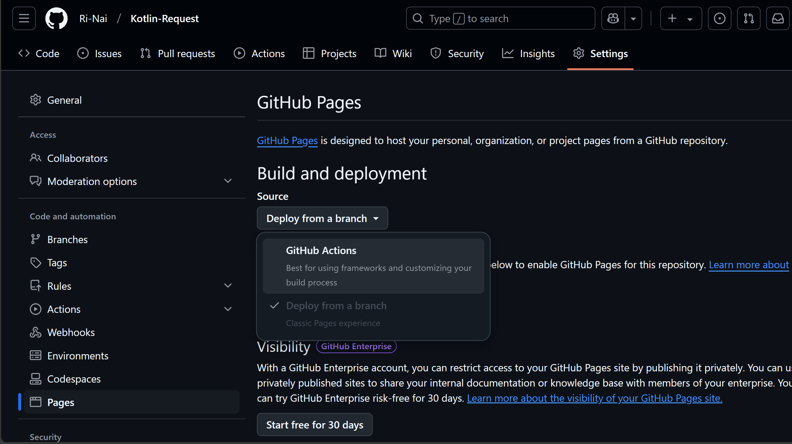

# 博客，启动

## 本地运行

### 安装 Hugo
你装过了

### 本地预览
```shell
hugo server -D
```

### 创建文章
推荐采用 `2025/03/05/title/index.md` 的格式，这样可以方便地按照时间查找文章。执行以下命令创建文章：
```shell
hugo new post/2025/03/05/博客启动/index.md
```
#### front matter

本篇文章的 front matter 如下：
```yaml
# 你的文章标题
title: 博客启动
# 你的文章描述，在首页展示
description: 你好，世界！
# 你的文章关键词，在文章头部显示
keywords: 博客启动

# 你的文章创建时间
date: 2025-03-05T15:26:27+08:00
# 你的文章最后修改时间
lastmod: 2025-03-05T15:26:27+08:00

math: true
mermaid: false

cover: /blog/post/2025/03/05/博客启动/cover.png

categories:
  - 建站记录
tags:
  - Hugo
  - 计算机科学与技术
```

### 配置博客

#### config yaml 文件

在原仓库 [hugo-theme-reimu](https://github.com/D-Sketon/hugo-theme-reimu) 的 `README` 中有详细的配置方法，你可以在 `config/_default/params.yml` 中修改配置。

tips:  
在 `config/_default/params.yml` 中修改的部分也可以在 `hugo.yaml` 中的 `params` 目录下修改  
常见的配置我已经写在 `hugo.yaml` 中了，你可以直接修改 `hugo.yaml` 中的配置  
不过 `config/_default/params.yml` 中的配置会覆盖 `hugo.yaml` 中的配置  
（如果你听不懂的话可以忽略这段话）

#### data yaml 文件

##### covers

在 `data/covers.yml` 中配置文章的默认随机封面，格式如下：
```yaml
- https://d-sketon.top/img/_backwebp/bg1.webp
- url_to_your_cover
```

##### friends

配置友链，照着 `data/friends.yml` 的格式写就行了


#### static 文件夹

在 `static` 文件夹中存放一些静态文件，比如图片、样式表等。

你可以把 `favicon.ico` 放在 `static` 文件夹中，这样你的博客就有了自己的图标。

## 部署到 GitHub Pages

### 创建仓库
先在你的 GitHub 上创建一个 `public` 的仓库，仓库名为 `blog`

找到 `settings` 


然后找到 `pages`


然后选择把 `Deploy from a branch` 改为 `GitHub Actions`


如果你有域名的话，在 `Custom domain` 中填入你的域名


### 配置 GitHub Actions
我配过了
在 `.github/workflows/deploy.yaml` 中有所记载

然后将你的博客文件夹上传到仓库中，即在博客根目录下，执行以下命令：

```shell
git init
git remote add origin https://github.com/vegetablefj/blog
git add .
git commit -m "<你的 commit 信息>"
git push -u origin master
```
然后返回 [你的仓库](https://github.com/vegetablefj/blog) 可以看到一个在部署的黄点
